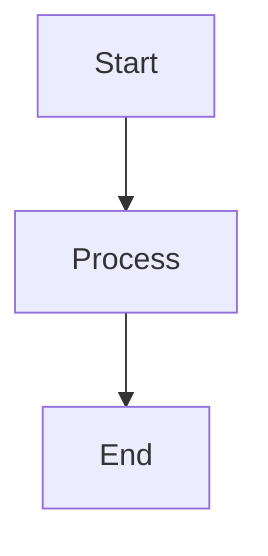

# Diagrams

This folder contains Mermaid diagrams for the 10xDevBookCard project.

## Usage

All diagrams are stored as `.md` files with Mermaid code blocks. You can preview them directly in Windsurf using Markdown Preview (Ctrl+Shift+V).

## Files

- Add diagram files here with `.md` extension
- Use the following format:

```markdown
# Diagram Name


```
