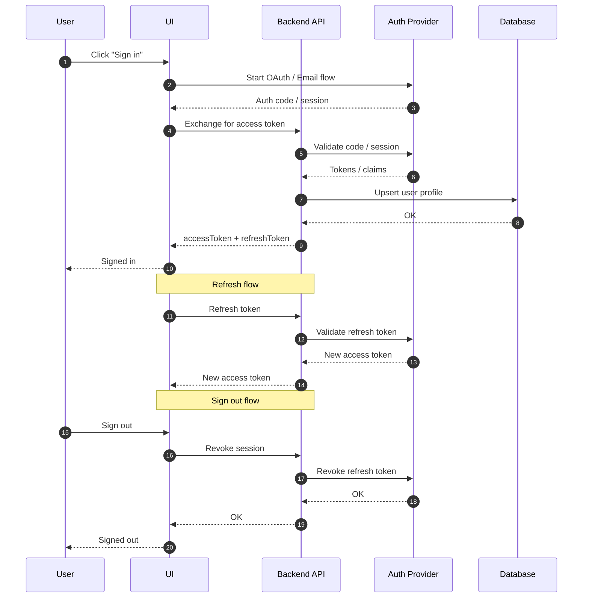

# Authentication Diagram

```mermaid
sequenceDiagram
  autonumber
  participant U as User
  participant UI as UI
  participant API as Backend API
  participant AUTH as Auth Provider
  participant DB as Database

  U->>UI: Click "Sign in"
  UI->>AUTH: Start OAuth / Email flow
  AUTH-->>UI: Auth code / session
  UI->>API: Exchange for access token
  API->>AUTH: Validate code / session
  AUTH-->>API: Tokens / claims
  API->>DB: Upsert user profile
  DB-->>API: OK
  API-->>UI: accessToken + refreshToken
  UI-->>U: Signed in

  Note over UI,API: Refresh flow
  UI->>API: Refresh token
  API->>AUTH: Validate refresh token
  AUTH-->>API: New access token
  API-->>UI: New access token

  Note over UI,API: Sign out flow
  U->>UI: Sign out
  UI->>API: Revoke session
  API->>AUTH: Revoke refresh token
  AUTH-->>API: OK
  API-->>UI: OK
  UI-->>U: Signed out
```
