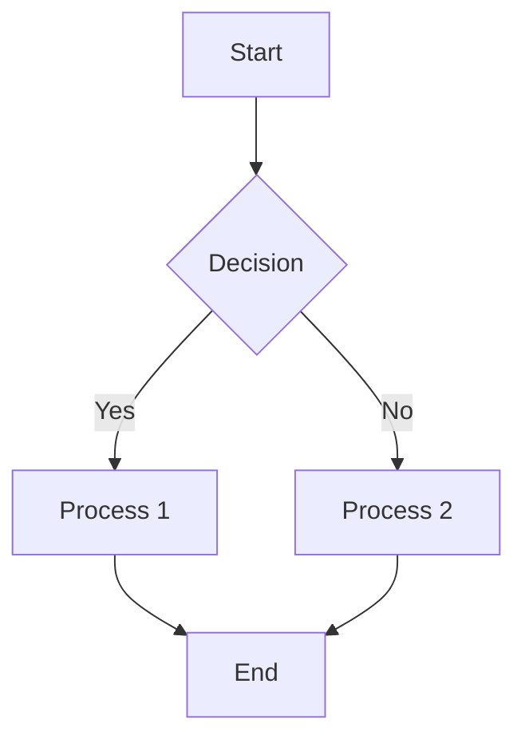

# Example Diagram
 
 > **Najważniejsze dokumenty (source of truth)**
 > - [GOVERNANCE](../GOVERNANCE.md)
 > - [PRD](../prd.md)
 

```mermaid
graph TD
    A[Start] --> B{Decision}
    B -->|Yes| C[Process 1]
    B -->|No| D[Process 2]
    C --> E[End]
    D --> E
```
